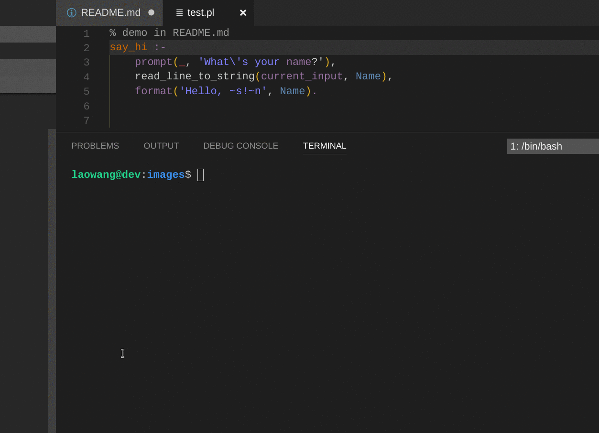
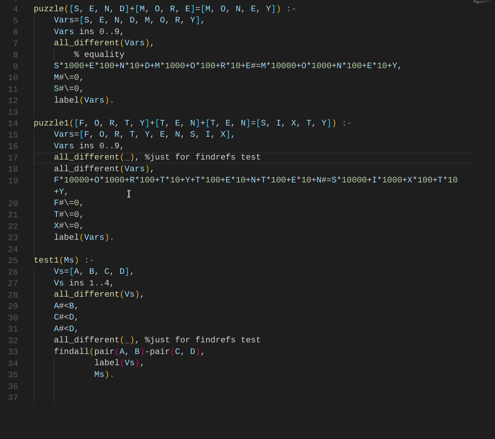
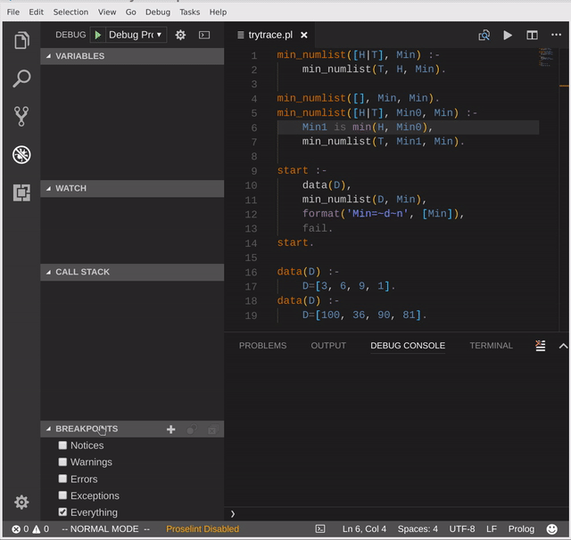
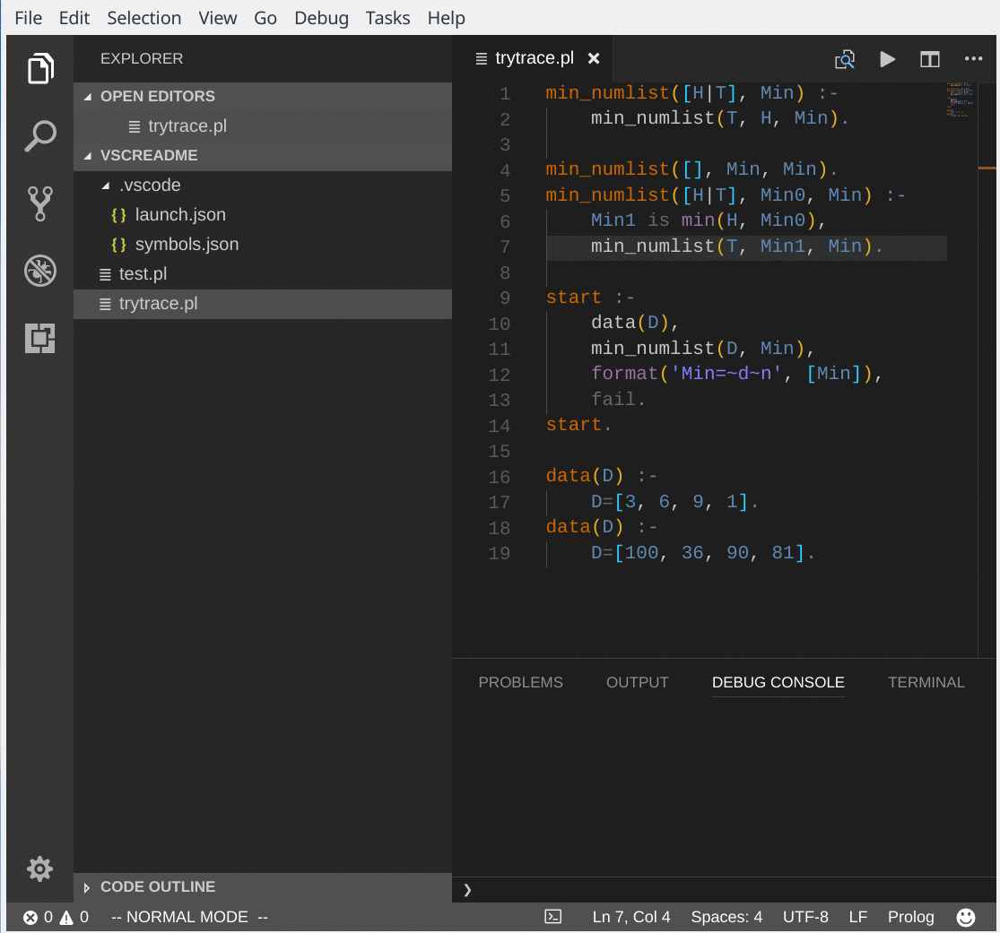

# New-VSC-Prolog

A VS Code extension which provides language support for Prolog (mainly for SWI-Prolog and some features for ECLiPSe). An improvement on Arthur Wang's previous [VSC-Prolog](https://marketplace.visualstudio.com/items?itemName=arthurwang.vsc-prolog) extension.

___________________
  [Features](#features) | [Configurations](#configurations) | [Debugger Settings](#debugger-settings) | [Commands & Keybindings](#commands-keybindings) | [Bug Reporting](https://github.com/AmauryRabouan/new-vsc-prolog/issues) 

## Note before installation

This extension can be installed via extensions viewlet of VS Code or 'Extensions: install extension' command from the command palette. The author notices that it is developed and tested in ***SWI-Prolog 9.0.4***, ***ECLiPSe 6.1*** and ***VS Code 1.86*** on ***Debian 9.0*** (stretch).  It's tested under Windows 11 but not other environments.
  * For Windows users: Run VS Code as administrator if going to switch to ECLiPSe from default SWI-Prolog or back to SWI from ECLiPSe. Non-administrator is ok while remain using the same dialect as last time.

## Features
  * [Syntax highlighting](#syntax-highlighting)
  * [Snippets](#predicate-snippets)
  * [Information Hovers](#information-hovers)
  * [Linter](#grammar-linter)
  * [Edit helpers](#edit-helpers)
    * [Import/Dynamic helper (SWI ONLY)](#import-or-dynamic-predicate-helper) 
    * [Export helper (SWI ONLY)](#export-helper)
    * [Recursion helper](#recursion-helper)
    * [Anonymous variable helper](#anonymous-variable-helper)
  * [Load active source file and query goals](#load-active-source-file-and-query-goals)
  * [Goto definition of predicate under cursor](#go-to-definition)
  * [Show all refences of predicate under cursor](#show-all-references-of-predicate-under-cursor)
  * [Refactor predicate under cursor(experimental)](#refactor-predicate-under-cursor)
  * [Code formatter](#code-formatter)
  * [Debugger(experimental, SWI ONLY)](#debugger)
    * Leep, creep, skip, Up, Stop, Restart
    * Breakpoints, including conditional breakpoints and hit count breakpoints
    * Spy(function breakpoints)
    * Data inspection
    * Evaluation

## Feature descriptions and usages

### Syntax highlighting
  * Based on sublimeprolog
  * Builtin pattern support

  

### Predicate snippets

  * Predicate templates auto-completion
  * Produced from source files with structured comments and html document of swipl system
  * Produced from created predicates, if there is structured comments from the user, it give their description (see example)

  
  

### Information hovers
  Hovers show Document information about the predicate under the mouse cursor.

  

### Grammar linter
  * Lint for errors, warning and undefined predicates of the source file in active editor window and its imported file
  * Errors are marked with red squiggles, Warnings green ones.
  * Mesage shown in OUTPUT and PROBLEMS channels
  * Clicking lines in PROBLEMS channels brings cursor to the respective lines in the editor
  * Traverse error lines in the editor by commands, the error/warning message responding to the line is presented in OUTPUT channel.
    * Prolog: Goto next error line (default map to f8) 
    * Prolog: Goto previous error line (default map to shift-f8)
  * Linter can be configured as action upon saving, typing and disabled by setting prolog.linter.run to 'onSave', 'onType' and 'never' respectively
    

### Edit helpers

#### Import or Dynamic predicate helper
  > This feature only works in SWI-Prolog.

  Clicking on the squiggle indicating 'undefined predicate' lights the yellow bulb in the left margin besides the line number. A suggesition list is presented when you click the bulb that includes 'add dynamic ' for the undefined predicate or 'import' it if VSC-Prolog finds it could be exported from some module(s). Triggering 'Add dynamic' inserts the predicate indicator into dynamic directive, or creates such a directive if no one exists. 'Add use_module' inserts ':- use_module' directive with the predicate indicator whithin the import list.

  

#### Recursion helper

  Leading dot (only spaces before it) of a line repeat the above nearest predicate or the head of current clause being edited if last line ends with comma, in which case the recursive variable change accordingly as intelligent as possible.
 

#### Anonymous variables helper

  Typing underscore in front of any parameters makes the parameter an anonymous variable.
  

### Load active source file and query goals

  * Command 'Prolog: load document' 
    (default map to alt-x l) loads the source file in active editor into prolog process in the integrated terminal, spawning the prolog process it if not opened. The prolog process provides a real prolog REPL console. 

  * Command 'Prolog: query goal under cursor'
    (default map to alt-x q) loads the source file and querys the goal under the cursor. You can call this command from editor context menu.
  

### Go to definition of predicate under cursor
  * Go to definition

    Editor/context menu command 'Go to Definition' (default map to f12) brings the cursor to the line where where the predicate is defined.
  * Peek definition

    Editor/context menu command 'Peek Definition' (default ctrl-shift-f10) pops up a panel to display the definition.

   

### Show all references of predicate under cursor

  Right click a predicate in editor, then trigger the command 'Find all references' from the editor context menu. All references of the predicate will be displayed in a popup panel.

  

### Refactor predicate under cursor

  Right click a predicate in editor, then trigger the command 'Refactor predicate under cursor' from the editor context menu. VSC-Prolog pops up a message box to ask for user confirmation and then an input box shows off to accept new predicate name that is used to replace the original one in all the references and its definition clause head(s). 
  
  If the user selects a builtin or foreign predicate and confirms in the warning box, all the predicate functor names of referencs would be replaced but the definition remains unchanged. This maybe is useful if you want to substitute a predicate with the same arity.

  > You'd better to commit the current stage of the version control system in VS Code before refactoring action in order to rollback refactoring results easily with one command of 'discard all changes' when the results are not what you expected.
  
  

### Code formatter

  Code formatting is iterative on all clauses, removing unnecessary spaces and adding new ones. It returns to the line by adding the number of tabs corresponding to the number of paratheses and braces.

  VSC-Prolog formats codes for three scopes of active document in editor:
   * document scope
    
    Right click any area of active prolog source document in editor to pop up editor context menu, then trigger the command 'Format Document' (default map to alt+shift+f). The whole document would be formatted.

  * selection scope

    Select an range and right click on the selection to pop up editor context menu, then trigger the command 'Format Selection' (default map to ctrl+k ctrl+f). VSC-Prolog would enlarge the selection to include complete terms if necessary and format the selection.

    
### Debugger

  > This feature only works in SWI-Prolog.

  The experimental debugger of VSC-Prolog tries to visualize the command line tracer of SWI-Prolog in VS Code. Read [VS Code handbook about debugging](https://code.visualstudio.com/docs/editor/debugging) for how VS Code debugging works generally.
  
  For the first time to debug in VS Code it is necessary to setup a launch.json file under .vscode directory in a project root. VS Code pops down a list of debug environments when you first click 'start debugging' button (f5) or the gear icon. The list contains 'Prolog' if VSC-Prolog extension is installed. A default launch.json file would be generated. Among the all settings, two must be set firstly: 'runtime executable' and 'startup query' according to your environment. 'runtime executable' points to your swipl executable path and 'startup query' refers to the goal you want to start debugging. ___There is only one file containing the 'startup goal' in a project.___ Refer to next section for detailed explanations about other settings.

  
* Trace options

  VSC-Prolog debugger supports basic trace options: leep, creep, skip, up, stop and restart.

  

* Breakpoints

  Before starting debugging, left click the editor margin on left of line number to toggle breakpoints. On debugging, the prolog process verifies the breakpoints and marks unverified ones with grey color. (Not working for now)
  > Note the limit of VSC-Prolog: Breakpoints must be set before starting debugging. Any breakpoints set during debugging are unavailable until next debugging process.

  

  * Conditional breakpoints

    Conditional breakpoints or expression breakpoints will be hit whenever the expression evaluates to true. Right click the red dot of the breakpoint to open the menu list which contains 'Edit Breakpoint' item that is a option list including 'Expression' and 'Hit Count'. Select 'Expression' to enter the condition for execution to stop. In VSC-Prolog, the expressions must be legal prolog predicates. Usually when the variables bind to some values the predicates success and the execution pauses at the breakpoint, as shown in the gif animation below where 'length(T, 1)' is the condition to break when the length of T is 1.

    

  * Hit count breakpoints

    The 'hit count' controls how many times a breakpoint needs to be hit before it will 'break' execution. That is, how many times execution passes the breakpoint before it pauses. Right click the red dot of the breakpoint to open the menu list which contains 'Edit Breakpoint' item that is a option list including 'Expression' and 'Hit Count'. Select 'Hit Count' to enter the number of the least hits to pass before stop.

    

  * Spy predicates

    VSC-Prolog implements spy predicates via function breakpoints in VS Code. 
    > Note: Spy predicates are not shown as breakpoints in editor. A 'spy breakpoint' is created by pressing the + button in the BREAKPOINTS section header and entering the predicate indicator.

    

* Data inspection

    Variables with their bound values whithin current clause can be inspected in the VARIABLES section of the Debug view or by hovering over their source in the editor or in the WATCH section.

    

    Debug Console is consist of output area and an input box. The output area displays all outputs from debugging and the input box can be used to input goals to evaluate in which you can use variables with current bound values.

    
  
    > Note about input from stdin during debugging:
    > 
    > The input box is also used to accept user input during debugging. While  a program is waiting for input from user, the yellow arrow indicating trace location would disappear. At this time you ___type firstly a semicolon___ followed by your real input contents. Another important point is that the prolog system prompt (default |:) would not show off anywhere, unless outputting prompts by stdout or stderr which piped to debug output area.

    

## Requirements

Latest versions of VS code and SWI-Prolog/ECLiPSe installed.

## Configurations

  * There are seven configurable settings with default values in VSC-Prolog:
    * "prolog.dialect": "swi",

      What dialect of prolog used:
        * swi: SWI-Prolog
        * ecl: ECLiPSe(eclipseclp).

    * "prolog.executablePath": "/usr/bin/swipl"

      Points to the Prolog executable.
    
    * "prolog.linter.run": "onType"

      How to trigger the linter: onType or onSave or never. 'onType' means linting is in nearly real time manner (controlled by next setting: prolog.linter.delay) whileas 'onSave' linter is called when saving the document. 'never' disables the linter.

    * "prolog.linter.delay": 500

      The milliseconds to delay when using onType trigger, that is, when pausing over this milliseconds between two key strokes the linter would be triggered.

    * "prolog.terminal.runtimeArgs": [ ]

      Arguments of Prolog executable run in terminal. This prolog process is used to load and execute the program in active editor, including 'query goal under cursor' command. This is a array of strings, i.e. ['-q', '-f', 'none'].

    * "prolog.format.enabled": true
       
       Enable or disable formatting source code.

    * "prolog.format.tabSize": 4
    
      The size of a tab in spaces, this and next setting affect the layout of formatted codes.

    * "prolog.format.insertSpaces": true,

      Prefer spaces over tabs

## Debugger settings

  Every project must have a launch.json configuration file under .vscode directory before starting debugging. VSC-Prolog's launch.json schema is excerpted as follows from the package.json of VSC-Prolog project. This file can be edited directly after generated for the first time to debug. 
  
  * program

    type: string

    default: "${file}"
    
    > DESCRIPTION:
    > Absolute path to the program. This parameter refers to the source file to start debugging. The default value '${file}' means the  active document file in editor when debugger is triggered.

  * startupQuery

    type: string

    default: "start"

    > DESCRIPTIO: The goal to query for starting debugging. VSC-Prolog debugger needs a point to start execution, this parameter is set for that purpose. The default value 'start' means that a start/0 predicate exists in active document. Any predicates can be used as entry point, as long as it can be queried and matched with this parameter setting.

  * stopOnEntry

    type: boolean

    default: true

    > DESCRIPTION: Automatically stop program after launch at entry point if this parameter set to 'true'. If set to 'false', the program would execute until a breakpoint, satisfied conditional breakpoint or hit count breakpoint or a spy predicate, otherwise go to the end if there are no such breakpoints. 

  * cwd

    type: string

    default: "${workspaceRoot}"

    > DESCRIPTION: Absolute path to the working directory of the source file being debugged. ${workspaceRoot} points to the root of user project.

  * env

    type: object

    default: {}

    additionalProperties: {type: string}

    > DESCRIPTION: Environment variables passed to the source file.

  * runtimeExecutable

    type: string

    default: "/usr/bin/swipl"

    > DESCRIPTION: Debug process executable. You can lookup it via 'which' command in unix-like operating system.

  * runtimeArgs

    type: array

    items: {type: string}

    default: []

    > DESCRIPTION: Command line arguments passed to the debug executable. It's an array of strings, i.e. ['-q', '-g', 'writeln(hello)'].

  * traceCmds

    type: object
    
    default: {"continue": ["leap", "l"], "stepover": ["skip", "s"],            "stepinto": ["creep", "c"], "stepout": ["up", "u"]}

    >  DESCRIPTION: Mapping between vscode debug commands and prolog trace options. They are command line tracer options VSC-Prolog supports. Reserved for multiple prolog systems supports in future. Don't modify them now.

##  Commands keybindings

   

## Known Issues

  * The debugger doesn't support clp(constraint logic programming).

  * Formatting for ECLiPSe might not work (not tested). 

  * During debug tracing, prompt for stdin input doesn't display in debug console. 

  * Syntax highlighting does not support multiline regular expression match, that's choosen by design of Sublime tmlanguage. Thus syntax highlighting maybe is wrong some times.

## [Release Notes](CHANGELOG.md)

## Bug reporting

  Feel free to report bugs or suggestions via [issues](https://github.com/AmauryRabouan/new-vsc-prolog/issues)

## Contributions

  [Pull requests](https://github.com/AmauryRabouan/new-vsc-prolog/pulls) are welcome.

## Acknowledgements
  Created by [Amaury Rabouan](https://www.linkedin.com/in/amauryrabouan/?locale=en_US) and [Guillaume Nollet](https://www.linkedin.com/in/guillaume-nollet/) 
  Thanks to Arthur Wang for creating the VSC-Prolog extension which served as a basis for creating this extension. 
  Thanks to our school ([ESIEA](https://www.esiea.fr/en/)) for making this project possible.

## License

  [MIT](http://www.opensource.org/licenses/mit-license.php)
