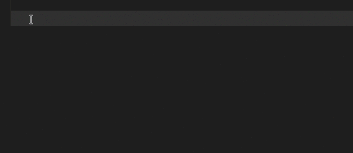

# VSC-Prolog

A VS Code extension which supports for Prolog (just SWI-Prolog now) in VS Code.

## Note before installation

This extension can be installed via extensions viewer of VS Code or 'extension install' command from the command palette. But it is developed and tested in SWI-Prolog 7.4.2 and VS Code 1.14 on Debian 9.0(stretch). Other environments are not yet tested.

## Features
  * Syntax highlighting
  * Snippets
  * Information Hovers
  * Linter
  * Edit helpers
    * Import/Dynamic helper
    * Export helper
    * Recursion helper
    * Anonymous variable helper
  * Load and run active source file
  * Goto definition
  * Code formatter
  * Debugger
    * Leep
    * Stepinto
    * Stepover
    * Up
    * Stop
    * Restart
    * Breakpoints, including conditional breakpoints and hit count breakpoints
    * Spy(function breakpoints)
    * Variable watcher
    * Evaluation

## Feature descriptions and usages

### Syntax highlighting
  * Based on sublimeprolog
  * Builtin pattern support
  

### Predicate Snippets
  * Predicate templates auto-completion
  * Produced from source files with structured comments and html document of swipl system
  

### Infomation Hovers
Hovers show Document information about the predicate under the mouse cursor.

### Grammar linter
  * Lint for errors, warning and undefined predicates of the source file in active editor window and its imported file
  * Mesage shown in OUTPUT and PROBLEMS channels
  * Clicking lines in PROBLEMS channels brings cursor to the respective lines in the editor
  * Traverse error lines in the editor by commands, the error/warning message responding to the line is presented in OUTPUT channel.
    * Prolog: Goto next error line (default mapped to f8) 
    * Prolog: Goto previous error line (default mapped to shift-f8)
  

### Edit helpers

* Import/Dynamic predicate helper

  Clicking on the squiggle indicating 'undefined predicate' lights the yellow bulb in left of the line. A suggesition list is presented when you click the bulb. The suggestion includes 'add dynamic ' for the undefined predicate or 'import' it if VSC-Prolog finds it's exported from some module(s).

* Export helper

  Move cursor to the line to be exported and right click it to pop up the Editor/context menu. Click the command: "Prolog: export predicate under cursor" to insert :- module/2 if module is not defined or add to the exporting list otherwise. After that a message box displays to ask for if adding structured comment for the predicate and comment lines are inserted above the head of the clause.
 

* Recursion helper

  Leading dot (only spaces before it) of a line repeat the above nearest predicate or the head of current clause if last line ends with comma, in which case the recursive variable change accordingly as intelligent as possible.

* Anonymous variables helper

  Typing underscore in front of any parameters makes the parameter an anonymous variable.
  

### Load and run program in prolog process

Command 'Prolog: load document' (default mapped to alt-x l) loads the source file in active editor into prolog process, opening a prolog process if it has not been opened. The prolog process provides a real prolog REPL console.

### Go to definition

Describe specific features of your extension including screenshots of your extension in action. Image paths are relative to this README file.

For example if there is an image subfolder under your extension project workspace:

\!\[feature X\]\(images/feature-x.png\)

> Tip: Many popular extensions utilize animations. This is an excellent way to show off your extension! We recommend short, focused animations that are easy to follow.

## Requirements

If you have any requirements or dependencies, add a section describing those and how to install and configure them.

## Extension Settings

Include if your extension adds any VS Code settings through the `contributes.configuration` extension point.

For example:

This extension contributes the following settings:

* `myExtension.enable`: enable/disable this extension
* `myExtension.thing`: set to `blah` to do something

## Known Issues

Calling out known issues can help limit users opening duplicate issues against your extension.
### Formatting doesn't work when there are singleton variables including named underscore-starting singleton variables in the scopes to be formatted.
### During debug tracing, prompt for stdin input doesn't display in debug console. When the yellow location arrow in editor disappears and the curren goal is a read from stdin, then the tracer is waiting for your input. Then in the input box at the bottom of the debug console TYPE a COLON (:) followed by the content of input, that is used to defferiate input with the other function of the input box: expressions for evaluation. In the later case, just input valid prolog terms.
### Syntax highlighting does not support multiline regular expression match, that's choosen by design of Sublime tmlanguage.

## Release Notes

Users appreciate release notes as you update your extension.

### 1.0.0

Initial release of ...

### 1.0.1

Fixed issue #.

### 1.1.0

Added features X, Y, and Z.

-----------------------------------------------------------------------------------------------------------

## Working with Markdown

**Note:** You can author your README using Visual Studio Code.  Here are some useful editor keyboard shortcuts:

* Split the editor (`Cmd+\` on OSX or `Ctrl+\` on Windows and Linux)
* Toggle preview (`Shift+CMD+V` on OSX or `Shift+Ctrl+V` on Windows and Linux)
* Press `Ctrl+Space` (Windows, Linux) or `Cmd+Space` (OSX) to see a list of Markdown snippets

### For more information

* [Visual Studio Code's Markdown Support](http://code.visualstudio.com/docs/languages/markdown)
* [Markdown Syntax Reference](https://help.github.com/articles/markdown-basics/)

**Enjoy!**
