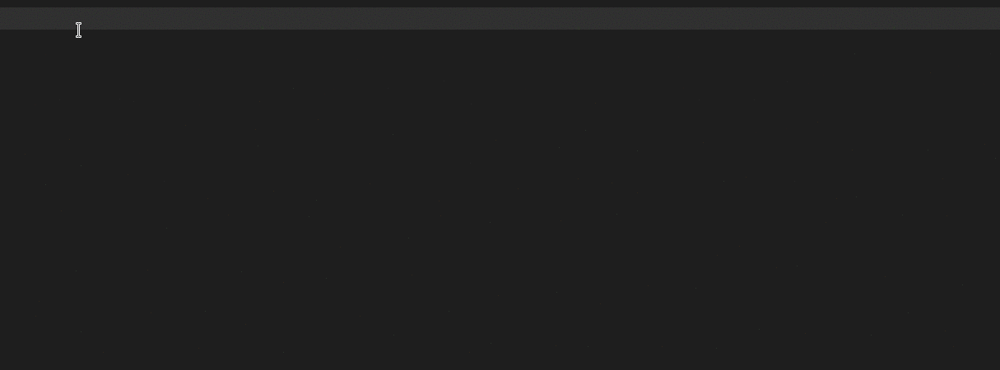
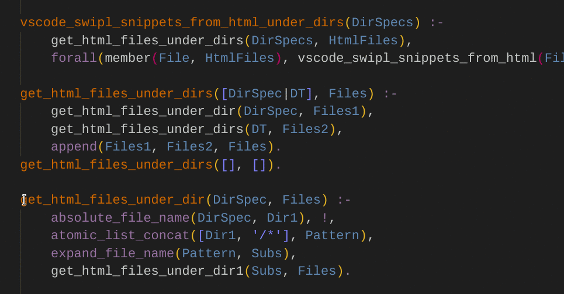
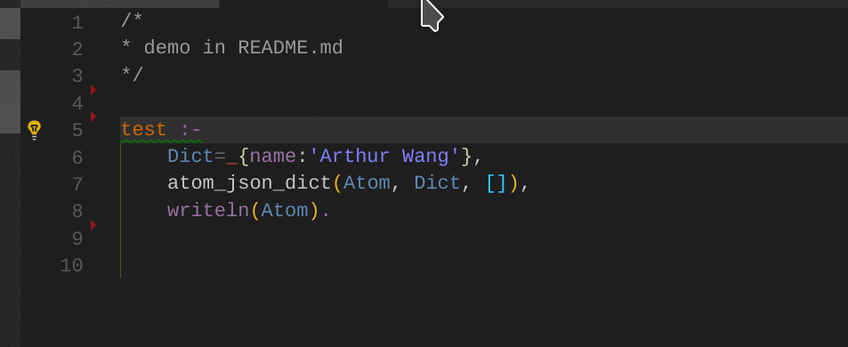
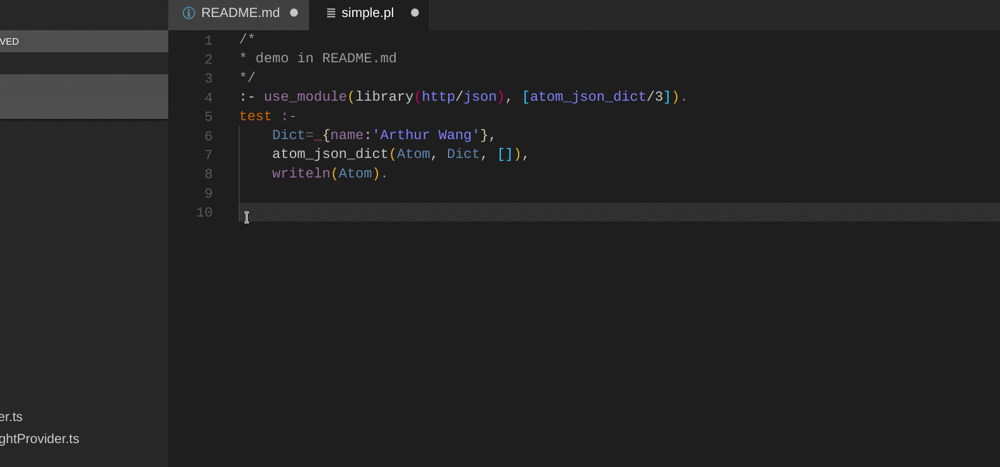
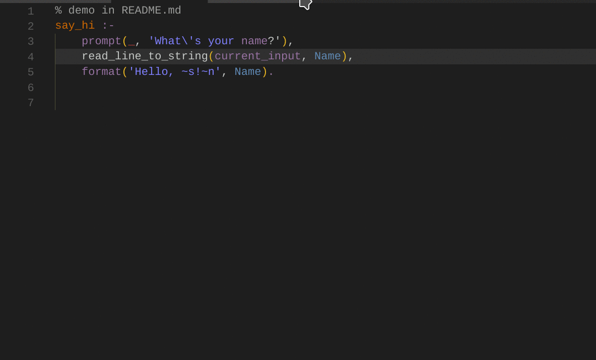

# VSC-Prolog

A VS Code extension which provides language support for Prolog (just SWI-Prolog now).

## Note before installation

This extension can be installed via extensions viewer of VS Code or 'extension install' command from the command palette. The author notices that it is developed and tested in ***SWI-Prolog 7.4.2*** and ***VS Code 1.14*** on ***Debian 9.0*** (stretch). Other environments are yet not tested.

## Features
  * [Syntax highlighting](#syntax-highlighting)
  * [Snippets](#predicate-snippets)
  * [Information Hovers](#information-hovers)
  * [Linter](#grammar-linter)
  * [Edit helpers](#edit-helpers)
    * [Import/Dynamic helper](#import-or-dynamic-predicate-helper)
    * [Export helper](#export-helper)
    * [Recursion helper](#recursion-helper)
    * [Anonymous variable helper](#anonymous-variable-helper)
  * [Load active source file and query goals](#load-active-source-file-and-query-goals)
  * [Goto definition](#go-to-definition)
  * [Code formatter](#code-formatter)
  * [Debugger(experimental)](#debugger)
    * Leep, creep, skip, Up, Stop, Restart
    * Breakpoints, including conditional breakpoints and hit count breakpoints
    * Spy(function breakpoints)
    * Variable watcher
    * Evaluation

## Feature descriptions and usages

### Syntax highlighting
  * Based on sublimeprolog
  * Builtin pattern support

  

### Predicate snippets

  * Predicate templates auto-completion
  * Produced from source files with structured comments and html document of swipl system

  

### Information hovers
  Hovers show Document information about the predicate under the mouse cursor.

  

### Grammar linter
  * Lint for errors, warning and undefined predicates of the source file in active editor window and its imported file
  * Mesage shown in OUTPUT and PROBLEMS channels
  * Clicking lines in PROBLEMS channels brings cursor to the respective lines in the editor
  * Traverse error lines in the editor by commands, the error/warning message responding to the line is presented in OUTPUT channel.
    * Prolog: Goto next error line (default map to f8) 
    * Prolog: Goto previous error line (default map to shift-f8)
    
  

### Edit helpers

#### Import or Dynamic predicate helper

  Clicking on the squiggle indicating 'undefined predicate' lights the yellow bulb in left of the line. A suggesition list is presented when you click the bulb. The suggestion includes 'add dynamic ' for the undefined predicate or 'import' it if VSC-Prolog finds it's exported from some module(s).
  

#### Export helper

  Move cursor to the head of a clause or a fact to be exported and trigger the command 'Prolog: export predicate under cursor' via command palette or right click the predicate to pop up the Editor/context menu which contains the command. Then VSC-Prolog inserts :- module/2 if module is not defined or adds the predicate indicator to the exporting list otherwise. After that a message box displays that asks for if adding structured comment for the predicate and comment lines are inserted above the head of the clause if 'yes' chosen.

 

#### Recursion helper

  Leading dot (only spaces before it) of a line repeat the above nearest predicate or the head of current clause if last line ends with comma, in which case the recursive variable change accordingly as intelligent as possible.
 

#### Anonymous variables helper

  Typing underscore in front of any parameters makes the parameter an anonymous variable.
  

### Load active source file and query goals

  * Command 'Prolog: load document' 
    (default map to alt-x l) loads the source file in active editor into prolog process in the integrated terminal, opening it if not beeing opened. The prolog process provides a real prolog REPL console. 

  * Command 'Prolog: query goal under cursor'
    (default map to alt-x q) loads the source file and querys the goal under the cursor.
  

### Go to definition
  * Go to definition
    Editor/context menu command 'Go to Definition' (default map to f12) brings the cursor to from the predicate to where it is defined.
  * Peek definition
    Editor/context menu command 'Peek Definition' (default ctrl-shift-f10) pops up a panel to display the definition.
   

### Code formatter

  Code formatting is implemented via calling portray_clause/1, so the beautification style is depended on portray_clause. Thus two limits should be reminded.
  * Terms with any grammar grammar errors are not formatted
  * Terms with singleton variables, including named anonymous variables are not formatted, since portray_clause outputs singletons as anonymous variables resulting in user's intention alteration.

  VSC-Prolog formats codes for three scopes of active document in editor:
  * document scope
    
    Right click any area of active prolog source document in editor to pop up editor context menu, then trigger the command 'Format Document' (default map to alt+shift+f). The whole document would be formatted.

  * selection scope

    Select an range and right click on the selection to pop up editor context menu, then trigger the command 'Format Selection' (default map to ctrl+k ctrl+f). VSC-Prolog would enlarge the selection to include complete terms if necessary and format the selection.

    * clause scope

    VSC-Prolog formats the current clause or fact when the user types the end dot symbol.

    
### Debugger

  The experimental debugger of VSC-Prolog tries to visualize the command line tracer of SWI-Prolog in VS Code.   
  
  For the first time to debug in VS Code it is necessary to setup a launch.json file under .vscode in a project root directory. VS Code pops down a list of debug environments when you first click 'start debugging' button (f5) or the gear icon. The list contains 'Prolog' if VSC-Prolog extension is installed. A default launch.json file would be generated. Among the all settings, two must be set firstly: 'runtime executable' and 'startup query' according to your environment. 'runtime executable' points to your swipl executable path and 'startup query' refers to the goal you want to start debugging. ___There is only one file containing the 'startup goal' in a project.___ Refer to next section for detailed explanations about other settings.

  
* Trace options

  VSC-Prolog debugger supports basic trace options: leep, creep, skip, up, stop and restart.

  

* Breakpoints

  Before starting debugging, left click the editor margin on left of line number to toggle breakpoints. On debugging, the prolog process verifies the breakpoints and marks unverified ones with grey color.
  > Note the limit of VSC-Prolog: Breakpoints must be set before starting debugging. Any breakpoints set during debugging are unavailable until next debugging process.

  

* Variables watch

* Evaluation

  

## Requirements

Latest versions of VS code and SWI-Prolog installed.

## Extension Settings

Include if your extension adds any VS Code settings through the `contributes.configuration` extension point.

For example:

This extension contributes the following settings:

* `myExtension.enable`: enable/disable this extension
* `myExtension.thing`: set to `blah` to do something

## Known Issues

### Formatting doesn't work when there are singleton variables including named underscore-starting singleton variables in the scopes to be formatted.
### During debug tracing, prompt for stdin input doesn't display in debug console. When the yellow location arrow in editor disappears and the curren goal is a read from stdin, then the tracer is waiting for your input. Then in the input box at the bottom of the debug console TYPE a COLON (:) followed by the content of input, that is used to defferiate input with the other function of the input box: expressions for evaluation. In the later case, just input valid prolog terms.
### Syntax highlighting does not support multiline regular expression match, that's choosen by design of Sublime tmlanguage.

## Release Notes

### 0.1.0

Initial release 

---------------------------------------

## Working with Markdown

**Note:** You can author your README using Visual Studio Code.  Here are some useful editor keyboard shortcuts:

* Split the editor (`Cmd+\` on OSX or `Ctrl+\` on Windows and Linux)
* Toggle preview (`Shift+CMD+V` on OSX or `Shift+Ctrl+V` on Windows and Linux)
* Press `Ctrl+Space` (Windows, Linux) or `Cmd+Space` (OSX) to see a list of Markdown snippets

### For more information

* [Visual Studio Code's Markdown Support](http://code.visualstudio.com/docs/languages/markdown)
* [Markdown Syntax Reference](https://help.github.com/articles/markdown-basics/)

**Enjoy!**
