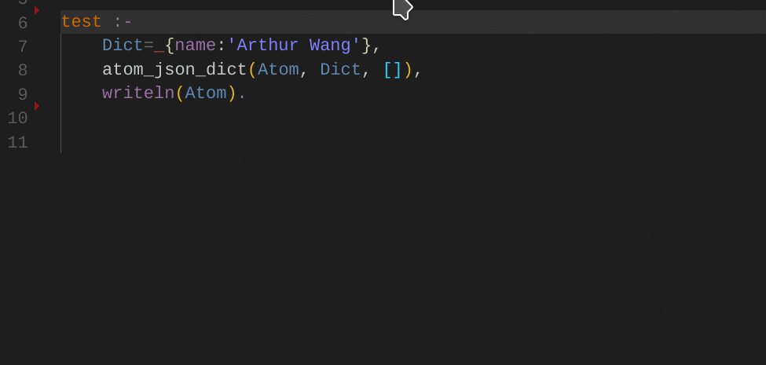
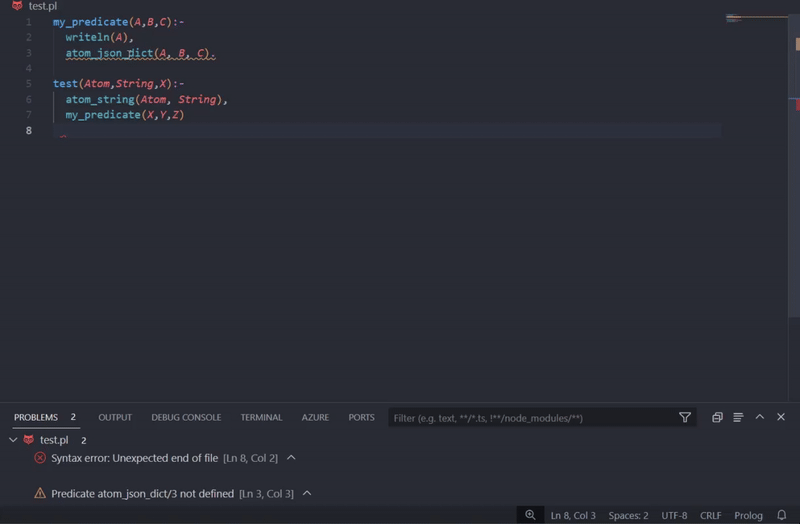

# VSC-Prolog

A VS Code extension which supports for Prolog (just SWI-Prolog now) in VS Code.

## Note before installation

This extension can be installed via extensions viewer of VS Code or 'extension install' command from the command palette. But it is developed and tested in SWI-Prolog 7.4.2. on Debian 9.0. Other environments are not yet tested.

## Features

### Syntax highlighting
The syntax highlighting is based on sublimeprolog. I add builtin pattern to differiate builtins from other predicates. 

### Predicate Snippets
 Snippets are programmatically produced from installed SWI-Prolog's source files with structured comments and html documents. Predicate templates would display in a auto-completetion suggestion lists with modes and document information in the right panel. 

### Infomation Hovers
Hovers show Document information about the predicate under the mouse cursor.

### Grammar linter
Linter marks grammar errors, warning and undefined predicates of current source file and imported files with squiggles while you type or save the file (configurable). The messages are presented in OUTPUT and PROBLEMS chennels. Clicking a line in PROBLEM chennel brings to the corresponding line in the editor. Stroking F8/shift-F8 in editor traverses lines where errors or warnings locate and the corresponding errors/warnings display in OUTPUT chennel.

### Import/Dynamic predicate helper
 Clicking on the squiggle indicating 'undefined predicate' lights the yellow bulb on left of the line. A suggesition list is presented when you click the bulb. The suggestion includes 'add dynamic ' for the undefined predicate or 'import' it if VSC-Prolog finds it's exported from some module(s).

### Export helper

### Recursion helper

### Runner in prolog process

### Go to definition

### 

Describe specific features of your extension including screenshots of your extension in action. Image paths are relative to this README file.

For example if there is an image subfolder under your extension project workspace:

\!\[feature X\]\(images/feature-x.png\)

> Tip: Many popular extensions utilize animations. This is an excellent way to show off your extension! We recommend short, focused animations that are easy to follow.

## Requirements

If you have any requirements or dependencies, add a section describing those and how to install and configure them.

## Extension Settings

Include if your extension adds any VS Code settings through the `contributes.configuration` extension point.

For example:

This extension contributes the following settings:

* `myExtension.enable`: enable/disable this extension
* `myExtension.thing`: set to `blah` to do something

## Known Issues

Calling out known issues can help limit users opening duplicate issues against your extension.
### Formatting doesn't work when there are singleton variables including named underscore-starting singleton variables in the scopes to be formatted.
### During debug tracing, prompt for stdin input doesn't display in debug console. When the yellow location arrow in editor disappears and the curren goal is a read from stdin, then the tracer is waiting for your input. Then in the input box at the bottom of the debug console TYPE a COLON (:) followed by the content of input, that is used to defferiate input with the other function of the input box: expressions for evaluation. In the later case, just input valid prolog terms.
### Syntax highlighting does not support multiline regular expression match, that's choosen by design of Sublime tmlanguage.

## Release Notes

Users appreciate release notes as you update your extension.

### 1.0.0

Initial release of ...

### 1.0.1

Fixed issue #.

### 1.1.0

Added features X, Y, and Z.

-----------------------------------------------------------------------------------------------------------

## Working with Markdown

**Note:** You can author your README using Visual Studio Code.  Here are some useful editor keyboard shortcuts:

* Split the editor (`Cmd+\` on OSX or `Ctrl+\` on Windows and Linux)
* Toggle preview (`Shift+CMD+V` on OSX or `Shift+Ctrl+V` on Windows and Linux)
* Press `Ctrl+Space` (Windows, Linux) or `Cmd+Space` (OSX) to see a list of Markdown snippets

### For more information

* [Visual Studio Code's Markdown Support](http://code.visualstudio.com/docs/languages/markdown)
* [Markdown Syntax Reference](https://help.github.com/articles/markdown-basics/)

**Enjoy!**
